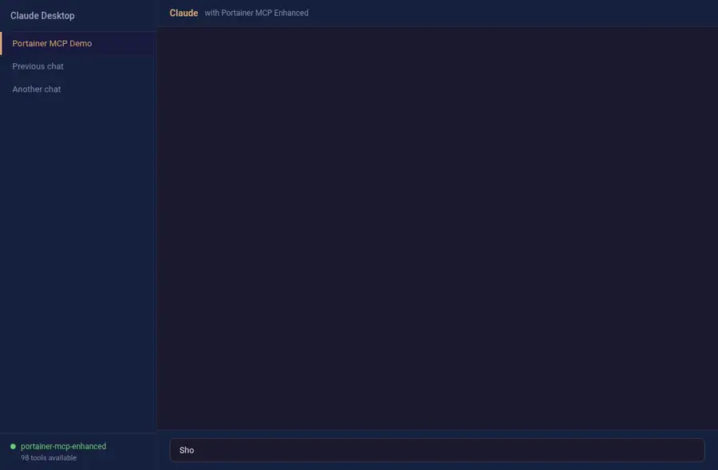

# Portainer MCP Enhanced

[](https://goreportcard.com/report/github.com/jmrplens/portainer-mcp-enhanced)

> **Community-enhanced fork of [portainer/portainer-mcp](https://github.com/portainer/portainer-mcp) with comprehensive API coverage.**

Portainer MCP Enhanced connects your AI assistant directly to your Portainer environments with **98 tools** covering the full Portainer API surface — compared to ~25 tools in the official version.

Manage stacks, users, teams, registries, templates, environments, edge computing, Kubernetes, Helm, backups, settings, and more — all through natural language via your AI assistant.



## Overview

This is a [Model Context Protocol (MCP)](https://modelcontextprotocol.io/introduction) server for Portainer. MCP standardizes how AI models interact with external tools and data sources.

This enhanced fork extends the official implementation to expose the **full Portainer API** through MCP tools, enabling AI assistants to perform any operation available in the Portainer web interface and beyond.

### Key Differences from Official Version

| Feature | Official | Enhanced |
|---------|----------|----------|
| Total tools | ~25 | **98** |
| Stack management | Edge stacks only | Edge + Regular + Git + Migrate |
| User management | List, update role | Full CRUD |
| Team management | List, create, update | Full CRUD |
| Registries | ❌ | Full CRUD |
| Custom templates | ❌ | Full CRUD |
| Webhooks | ❌ | List, create, delete |
| Backup/Restore | ❌ | Full (local + S3) |
| Settings management | Read only | Read + Update |
| SSL management | ❌ | Read + Update |
| Edge jobs | ❌ | Full CRUD |
| Edge update schedules | ❌ | List |
| Kubernetes dashboard | ❌ | Dashboard, namespaces, config |
| Docker dashboard | ❌ | Full dashboard data |
| Helm management | ❌ | Repos, charts, releases |
| Auth | ❌ | Login, logout |
| Roles | ❌ | List |
| App templates | ❌ | List, get file |
| MOTD | ❌ | Read |
| System status | ❌ | Status info |
| Environment snapshots | ❌ | Single + batch |
| Environment delete | ❌ | Delete |
| Tag delete | ❌ | Delete |

> [!NOTE]
> This fork is based on the official v0.6.0 release and maintains full backward compatibility. All original tools work identically.

## Installation

### Download Pre-built Binaries

Download from the [Releases Page](https://github.com/jmrplens/portainer-mcp-enhanced/releases/latest) for Linux (amd64, arm64) and macOS (arm64).

### Build from Source

```bash
git clone https://github.com/jmrplens/portainer-mcp-enhanced.git
cd portainer-mcp-enhanced
make build
```

The binary will be in `dist/portainer-mcp-<platform>-<arch>`.

### Go Install

```bash
go install github.com/jmrplens/portainer-mcp-enhanced/cmd/portainer-mcp@latest
```

## Configuration

### Getting a Portainer API Token

1. Log in to your Portainer instance
2. Click on your username in the top-right corner
3. Select **My Account**
4. Scroll to **API Keys** and create a new key
5. Copy the generated token

### MCP Client Configuration

#### Claude Desktop / Cursor

Add to your MCP settings configuration file:

```json
{
  "mcpServers": {
    "portainer": {
      "command": "/path/to/portainer-mcp",
      "args": [
        "--server-url", "https://your-portainer-instance:9443",
        "--api-token", "ptr_your_api_token_here"
      ]
    }
  }
}
```

#### VS Code (GitHub Copilot)

Add to `.vscode/mcp.json`:

```json
{
  "servers": {
    "portainer": {
      "type": "stdio",
      "command": "/path/to/portainer-mcp",
      "args": [
        "--server-url", "https://your-portainer-instance:9443",
        "--api-token", "ptr_your_api_token_here"
      ]
    }
  }
}
```

### Command-Line Flags

| Flag | Description | Required |
|------|-------------|----------|
| `--server-url` | Portainer server URL (e.g., `https://portainer:9443`) | Yes |
| `--api-token` | Portainer API token | Yes |
| `--read-only` | Enable read-only mode (disables all write/delete operations) | No |
| `--disable-version-check` | Skip Portainer version compatibility check | No |

### Read-Only Mode

Use `--read-only` to restrict the server to read-only operations only. This disables all create, update, delete, and destructive operations — useful for monitoring and observation without risk.

### Portainer Version Support

| MCP Enhanced Version | Based On | Supported Portainer Version |
|---------------------|----------|----------------------------|
| 1.0.0 | v0.6.0 | 2.31.2 |

> [!NOTE]
> Use `--disable-version-check` to connect to unsupported Portainer versions at your own risk.

## Supported Capabilities

### Access Groups (Endpoint Groups)

| Tool | Description | Read-Only |
|------|-------------|-----------|
| `listAccessGroups` | List all available access groups | ✅ |
| `createAccessGroup` | Create a new access group | ❌ |
| `updateAccessGroupName` | Update the name of an access group | ❌ |
| `updateAccessGroupUserAccesses` | Update user accesses for an access group | ❌ |
| `updateAccessGroupTeamAccesses` | Update team accesses for an access group | ❌ |
| `addEnvironmentToAccessGroup` | Add an environment to an access group | ❌ |
| `removeEnvironmentFromAccessGroup` | Remove an environment from an access group | ❌ |

### Environments (Endpoints)

| Tool | Description | Read-Only |
|------|-------------|-----------|
| `listEnvironments` | List all available environments | ✅ |
| `getEnvironment` | Get detailed information about a specific environment | ✅ |
| `deleteEnvironment` | Delete an environment permanently | ❌ |
| `snapshotEnvironment` | Trigger a snapshot refresh for a specific environment | ❌ |
| `snapshotAllEnvironments` | Trigger a snapshot refresh for all environments | ❌ |
| `updateEnvironmentTags` | Update tags associated with an environment | ❌ |
| `updateEnvironmentUserAccesses` | Update user access policies for an environment | ❌ |
| `updateEnvironmentTeamAccesses` | Update team access policies for an environment | ❌ |

### Environment Groups (Edge Groups)

| Tool | Description | Read-Only |
|------|-------------|-----------|
| `listEnvironmentGroups` | List all environment groups | ✅ |
| `createEnvironmentGroup` | Create a new environment group | ❌ |
| `updateEnvironmentGroupName` | Update the name of an environment group | ❌ |
| `updateEnvironmentGroupEnvironments` | Update environments in a group | ❌ |
| `updateEnvironmentGroupTags` | Update tags associated with a group | ❌ |

### Stacks — Edge Stacks

| Tool | Description | Read-Only |
|------|-------------|-----------|
| `listStacks` | List all edge stacks | ✅ |
| `getStackFile` | Get the compose file for an edge stack | ✅ |
| `createStack` | Create a new edge stack | ❌ |
| `updateStack` | Update an existing edge stack | ❌ |

### Stacks — Regular Stacks (Docker Compose / Swarm)

| Tool | Description | Read-Only |
|------|-------------|-----------|
| `listRegularStacks` | List all regular (non-edge) stacks | ✅ |
| `getStack` | Get detailed information about a specific stack | ✅ |
| `inspectStackFile` | Get the compose file content of a stack | ✅ |
| `deleteStack` | Delete a regular stack permanently | ❌ |
| `startStack` | Start a stopped stack | ❌ |
| `stopStack` | Stop a running stack | ❌ |
| `updateStackGit` | Update git configuration of a stack | ❌ |
| `redeployStackGit` | Trigger git-based redeployment of a stack | ❌ |
| `migrateStack` | Migrate a stack to another environment | ❌ |

### Tags

| Tool | Description | Read-Only |
|------|-------------|-----------|
| `listEnvironmentTags` | List all environment tags | ✅ |
| `createEnvironmentTag` | Create a new environment tag | ❌ |
| `deleteEnvironmentTag` | Delete an environment tag | ❌ |

### Teams

| Tool | Description | Read-Only |
|------|-------------|-----------|
| `listTeams` | List all teams | ✅ |
| `getTeam` | Get details of a specific team | ✅ |
| `createTeam` | Create a new team | ❌ |
| `deleteTeam` | Delete a team | ❌ |
| `updateTeamName` | Update the name of a team | ❌ |
| `updateTeamMembers` | Update the members of a team | ❌ |

### Users

| Tool | Description | Read-Only |
|------|-------------|-----------|
| `listUsers` | List all users | ✅ |
| `getUser` | Get details of a specific user | ✅ |
| `createUser` | Create a new user | ❌ |
| `deleteUser` | Delete a user | ❌ |
| `updateUserRole` | Update a user's role | ❌ |

### Registries

| Tool | Description | Read-Only |
|------|-------------|-----------|
| `listRegistries` | List all configured registries | ✅ |
| `getRegistry` | Get details of a specific registry | ✅ |
| `createRegistry` | Create a new registry | ❌ |
| `updateRegistry` | Update an existing registry | ❌ |
| `deleteRegistry` | Delete a registry | ❌ |

### Custom Templates

| Tool | Description | Read-Only |
|------|-------------|-----------|
| `listCustomTemplates` | List all custom templates | ✅ |
| `getCustomTemplate` | Get details of a specific custom template | ✅ |
| `getCustomTemplateFile` | Get the file content of a custom template | ✅ |
| `createCustomTemplate` | Create a new custom template | ❌ |
| `deleteCustomTemplate` | Delete a custom template | ❌ |

### Webhooks

| Tool | Description | Read-Only |
|------|-------------|-----------|
| `listWebhooks` | List all webhooks | ✅ |
| `createWebhook` | Create a new webhook | ❌ |
| `deleteWebhook` | Delete a webhook | ❌ |

### Docker

| Tool | Description | Read-Only |
|------|-------------|-----------|
| `dockerProxy` | Proxy any Docker API request to a specific environment | Depends on method |
| `getDockerDashboard` | Get Docker dashboard data (containers, images, volumes, networks) | ✅ |

### Kubernetes

| Tool | Description | Read-Only |
|------|-------------|-----------|
| `kubernetesProxy` | Proxy any Kubernetes API request to a specific environment | Depends on method |
| `getKubernetesResourceStripped` | Get K8s resources with verbose metadata automatically stripped | ✅ |
| `getKubernetesDashboard` | Get Kubernetes dashboard data for an environment | ✅ |
| `listKubernetesNamespaces` | List all namespaces in a Kubernetes environment | ✅ |
| `getKubernetesConfig` | Get the kubeconfig for a Kubernetes environment | ✅ |

### Helm

| Tool | Description | Read-Only |
|------|-------------|-----------|
| `listHelmRepositories` | List all Helm repositories configured for a user | ✅ |
| `addHelmRepository` | Add a Helm repository | ❌ |
| `removeHelmRepository` | Remove a Helm repository | ❌ |
| `searchHelmCharts` | Search for Helm charts in a repository | ✅ |
| `installHelmChart` | Install a Helm chart on an environment | ❌ |
| `listHelmReleases` | List all Helm releases on an environment | ✅ |
| `deleteHelmRelease` | Delete a Helm release | ❌ |
| `getHelmReleaseHistory` | Get the revision history of a Helm release | ✅ |

### Settings

| Tool | Description | Read-Only |
|------|-------------|-----------|
| `getSettings` | Get Portainer instance settings | ✅ |
| `updateSettings` | Update Portainer settings (partial update supported) | ❌ |
| `getPublicSettings` | Get public settings (available without auth) | ✅ |
| `getSSLSettings` | Get SSL certificate settings | ✅ |
| `updateSSLSettings` | Update SSL certificate and key | ❌ |

### Backup & Restore

| Tool | Description | Read-Only |
|------|-------------|-----------|
| `getBackupStatus` | Get the status of the last backup | ✅ |
| `getBackupS3Settings` | Get S3 backup settings | ✅ |
| `createBackup` | Create a local backup of the Portainer server | ❌ |
| `backupToS3` | Backup to S3-compatible storage | ❌ |
| `restoreFromS3` | Restore from S3-compatible storage | ❌ |

### Edge Computing

| Tool | Description | Read-Only |
|------|-------------|-----------|
| `listEdgeJobs` | List all edge jobs | ✅ |
| `getEdgeJob` | Get details of a specific edge job | ✅ |
| `getEdgeJobFile` | Get the script file content of an edge job | ✅ |
| `createEdgeJob` | Create a new edge job | ❌ |
| `deleteEdgeJob` | Delete an edge job | ❌ |
| `listEdgeUpdateSchedules` | List all edge update schedules | ✅ |

### Application Templates

| Tool | Description | Read-Only |
|------|-------------|-----------|
| `listAppTemplates` | List all available application templates | ✅ |
| `getAppTemplateFile` | Get the file content of an application template | ✅ |

### Authentication

| Tool | Description | Read-Only |
|------|-------------|-----------|
| `authenticate` | Authenticate with username and password, returns JWT token | ✅ |
| `logout` | Log out the current user session | ❌ |

### Roles

| Tool | Description | Read-Only |
|------|-------------|-----------|
| `listRoles` | List all available roles with their authorizations | ✅ |

### System

| Tool | Description | Read-Only |
|------|-------------|-----------|
| `getSystemStatus` | Get system status including version and instance ID | ✅ |
| `getMOTD` | Get the Portainer message of the day | ✅ |

## Development

### Building

```bash
make build                                    # Build for current platform
make PLATFORM=linux ARCH=amd64 build          # Build for specific platform
```

### Testing

```bash
go test -v ./...                              # Run unit tests
make test-all                                 # Run all tests
```

### Live Testing

The project includes a comprehensive live test suite that validates all 98 tools against a real Portainer instance:

```bash
export PORTAINER_LIVE_URL="your-portainer-host:9443"
export PORTAINER_LIVE_TOKEN="ptr_your_token"
go test -v ./tests/live/ -count=1
```

Live tests follow non-destructive patterns: they create test resources, validate operations, and clean up afterward.

### Code Statistics

```bash
./cloc.sh                                     # Lines of code metrics
```

### Token Counting

Estimate token consumption for tool definitions sent to AI models:

```bash
go run ./cmd/token-count -input internal/tooldef/tools.yaml -output .tmp/tools.json
./token.sh -k <anthropic-api-key> -i .tmp/tools.json
```

## Architecture

```
cmd/portainer-mcp/       # Entry point
internal/
  mcp/                   # MCP server, handlers, tool registration
  tooldef/               # Tool definitions (tools.yaml, embedded at build time)
pkg/portainer/
  client/                # Wrapper client over portainer/client-api-go SDK
  models/                # Local models with conversion from raw SDK models
tests/
  live/                  # Live tests against real Portainer instance
docs/
  design/                # Design decision records
  clients_and_models.md  # Client architecture documentation
```

For detailed architecture documentation, see [docs/clients_and_models.md](docs/clients_and_models.md).

## Contributing

Contributions are welcome! Please:

1. Fork the repository
2. Create a feature branch from `main`
3. Follow the existing code style and patterns
4. Add tests for new functionality
5. Submit a pull request

## Related

- [Official Portainer MCP](https://github.com/portainer/portainer-mcp) — Original implementation
- [Portainer](https://www.portainer.io/) — Container management platform
- [MCP Protocol](https://modelcontextprotocol.io/) — Model Context Protocol specification
- [PR #45](https://github.com/portainer/portainer-mcp/pull/45) — Our contribution to the official repo

## License

[MIT License](LICENSE)
