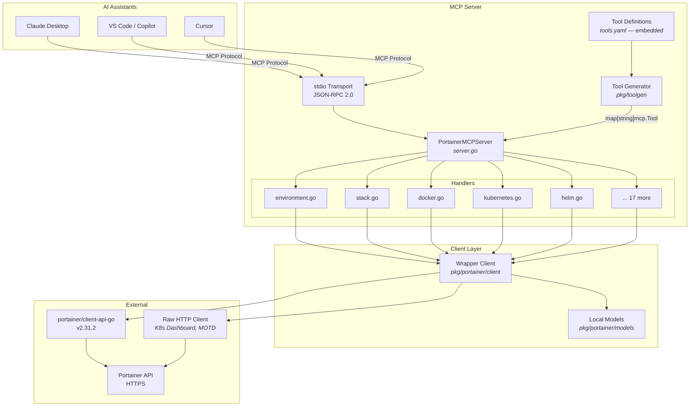

<div align="center">

# Portainer MCP Server

**Manage your entire Portainer infrastructure through AI assistants using the Model Context Protocol**

[](https://goreportcard.com/report/github.com/portainer/portainer-mcp)
[](https://codecov.io/gh/portainer/portainer-mcp)


[Quickstart](#quickstart) · [Tools Reference](#tools-reference) · [Configuration](#configuration) · [Architecture](#architecture) · [Contributing](CONTRIBUTING.md)

</div>

---

A [Model Context Protocol (MCP)](https://modelcontextprotocol.io/introduction) server that connects AI assistants to [Portainer](https://www.portainer.io/) — exposing **98 tools** covering the complete Portainer API. Manage environments, stacks, users, teams, registries, Kubernetes, Helm, Docker, edge computing, backups, and more through natural language.

<details open>
<summary><b>🖥️ System & Docker Dashboard</b></summary>


</details>

<details>
<summary><b>👥 Users, Teams & Stacks</b></summary>


</details>

<details>
<summary><b>🌐 Edge & Kubernetes</b></summary>


</details>

<details>
<summary><b>💾 Backup & Docker Proxy</b></summary>


</details>

## Quickstart

### 1. Download

Grab the latest binary from [Releases](https://github.com/portainer/portainer-mcp/releases/latest) for your platform (Linux amd64/arm64, macOS arm64), or build from source:

```bash
git clone https://github.com/portainer/portainer-mcp.git
cd portainer-mcp
make build
# Binary: dist/portainer-mcp
```

### 2. Get a Portainer API Token

1. Log in to your Portainer instance → **My Account** → **API Keys**
2. Create a new key and copy the token

### 3. Configure your AI assistant

<details open>
<summary><b>Claude Desktop</b></summary>

Edit `~/Library/Application Support/Claude/claude_desktop_config.json` (macOS) or `%APPDATA%\Claude\claude_desktop_config.json` (Windows):

```json
{
  "mcpServers": {
    "portainer": {
      "command": "/path/to/portainer-mcp",
      "args": [
        "-server", "https://your-portainer:9443",
        "-token", "ptr_your_api_token"
      ]
    }
  }
}
```
</details>

<details>
<summary><b>VS Code (GitHub Copilot)</b></summary>

Create `.vscode/mcp.json` in your workspace:

```json
{
  "servers": {
    "portainer": {
      "type": "stdio",
      "command": "/path/to/portainer-mcp",
      "args": [
        "-server", "https://your-portainer:9443",
        "-token", "ptr_your_api_token"
      ]
    }
  }
}
```
</details>

<details>
<summary><b>Cursor</b></summary>

Go to **Cursor Settings → MCP** and add:

```json
{
  "mcpServers": {
    "portainer": {
      "command": "/path/to/portainer-mcp",
      "args": [
        "-server", "https://your-portainer:9443",
        "-token", "ptr_your_api_token"
      ]
    }
  }
}
```
</details>

### 4. Start asking

> "List all environments and their status"
> "Create a new nginx stack from this compose file"
> "Show me the Kubernetes dashboard for environment 3"

## Configuration

### Command-Line Flags

| Flag | Description | Required | Default |
|------|-------------|----------|---------|
| `-server` | Portainer server URL | **Yes** | — |
| `-token` | Portainer API token | **Yes** | — |
| `-tools` | Path to custom tools.yaml | No | Embedded |
| `-read-only` | Disable all write/delete operations | No | `false` |
| `-disable-version-check` | Skip Portainer version validation | No | `false` |

### Read-Only Mode

Run with `-read-only` to restrict to 46 read-only tools. All write, update, and delete operations are disabled — ideal for monitoring and observation.

```json
{
  "args": ["-server", "...", "-token", "...", "-read-only"]
}
```

### Version Compatibility

The server validates the Portainer instance version at startup. Use `-disable-version-check` to bypass this for unsupported versions.

| MCP Server | Supported Portainer |
|------------|-------------------|
| v0.6.x | 2.31.2 |
| v0.5.x | 2.30.0 |
| v0.4.x | 2.27.4 |

## Tools Reference

**98 tools** organized into 20 categories. Each tool includes MCP annotations (`readOnlyHint`, `destructiveHint`, `idempotentHint`, `openWorldHint`) for safe AI operation.

> 🔒 = Available in read-only mode · ✏️ = Write operation · ⚠️ = Destructive operation

### Access Groups (7 tools)

| Tool | Description | Mode |
|------|-------------|------|
| `listAccessGroups` | List all available access groups | 🔒 |
| `createAccessGroup` | Create a new access group | ✏️ |
| `updateAccessGroupName` | Update the name of an access group | ✏️ |
| `updateAccessGroupUserAccesses` | Update user accesses for an access group | ✏️ |
| `updateAccessGroupTeamAccesses` | Update team accesses for an access group | ✏️ |
| `addEnvironmentToAccessGroup` | Add an environment to an access group | ✏️ |
| `removeEnvironmentFromAccessGroup` | Remove an environment from an access group | ⚠️ |

### Environments (8 tools)

| Tool | Description | Mode |
|------|-------------|------|
| `listEnvironments` | List all available environments | 🔒 |
| `getEnvironment` | Get detailed info about a specific environment | 🔒 |
| `deleteEnvironment` | Delete an environment permanently | ⚠️ |
| `snapshotEnvironment` | Trigger a snapshot for a specific environment | ✏️ |
| `snapshotAllEnvironments` | Trigger a snapshot for all environments | ✏️ |
| `updateEnvironmentTags` | Update tags associated with an environment | ✏️ |
| `updateEnvironmentUserAccesses` | Update user access policies | ✏️ |
| `updateEnvironmentTeamAccesses` | Update team access policies | ✏️ |

### Environment Groups (5 tools)

| Tool | Description | Mode |
|------|-------------|------|
| `listEnvironmentGroups` | List all environment groups | 🔒 |
| `createEnvironmentGroup` | Create a new environment group | ✏️ |
| `updateEnvironmentGroupName` | Rename an environment group | ✏️ |
| `updateEnvironmentGroupEnvironments` | Update group environments | ✏️ |
| `updateEnvironmentGroupTags` | Update group tags | ✏️ |

### Stacks (13 tools)

**Edge Stacks:**

| Tool | Description | Mode |
|------|-------------|------|
| `listStacks` | List all edge stacks | 🔒 |
| `getStackFile` | Get compose file for an edge stack | 🔒 |
| `createStack` | Create a new edge stack | ✏️ |
| `updateStack` | Update an edge stack | ✏️ |

**Regular Stacks (Docker Compose / Swarm):**

| Tool | Description | Mode |
|------|-------------|------|
| `listRegularStacks` | List all regular stacks | 🔒 |
| `getStack` | Get details of a regular stack | 🔒 |
| `inspectStackFile` | Get compose file content | 🔒 |
| `deleteStack` | Delete a stack permanently | ⚠️ |
| `startStack` | Start a stopped stack | ✏️ |
| `stopStack` | Stop a running stack | ✏️ |
| `updateStackGit` | Update git configuration | ✏️ |
| `redeployStackGit` | Trigger git-based redeployment | ✏️ |
| `migrateStack` | Migrate stack to another environment | ✏️ |

### Tags (3 tools)

| Tool | Description | Mode |
|------|-------------|------|
| `listEnvironmentTags` | List all tags | 🔒 |
| `createEnvironmentTag` | Create a new tag | ✏️ |
| `deleteEnvironmentTag` | Delete a tag | ⚠️ |

### Teams (6 tools)

| Tool | Description | Mode |
|------|-------------|------|
| `listTeams` | List all teams | 🔒 |
| `getTeam` | Get team details | 🔒 |
| `createTeam` | Create a new team | ✏️ |
| `deleteTeam` | Delete a team | ⚠️ |
| `updateTeamName` | Rename a team | ✏️ |
| `updateTeamMembers` | Update team members | ✏️ |

### Users (5 tools)

| Tool | Description | Mode |
|------|-------------|------|
| `listUsers` | List all users | 🔒 |
| `getUser` | Get user details | 🔒 |
| `createUser` | Create a new user | ✏️ |
| `deleteUser` | Delete a user | ⚠️ |
| `updateUserRole` | Update user role | ✏️ |

### Docker (2 tools)

| Tool | Description | Mode |
|------|-------------|------|
| `dockerProxy` | Proxy any Docker Engine API request | 🔒 |
| `getDockerDashboard` | Get dashboard data (containers, images, volumes, networks) | 🔒 |

### Kubernetes (5 tools)

| Tool | Description | Mode |
|------|-------------|------|
| `kubernetesProxy` | Proxy any Kubernetes API request | 🔒 |
| `getKubernetesResourceStripped` | GET K8s resources with metadata stripped | 🔒 |
| `getKubernetesDashboard` | Get K8s dashboard summary | 🔒 |
| `listKubernetesNamespaces` | List K8s namespaces | 🔒 |
| `getKubernetesConfig` | Get kubeconfig for an environment | 🔒 |

### Helm (8 tools)

| Tool | Description | Mode |
|------|-------------|------|
| `listHelmRepositories` | List Helm repos for a user | 🔒 |
| `addHelmRepository` | Add a Helm repository | ✏️ |
| `removeHelmRepository` | Remove a Helm repository | ⚠️ |
| `searchHelmCharts` | Search charts in a repository | 🔒 |
| `installHelmChart` | Install a Helm chart | ✏️ |
| `listHelmReleases` | List Helm releases | 🔒 |
| `deleteHelmRelease` | Delete a Helm release | ⚠️ |
| `getHelmReleaseHistory` | Get release revision history | 🔒 |

### Registries (5 tools)

| Tool | Description | Mode |
|------|-------------|------|
| `listRegistries` | List all registries | 🔒 |
| `getRegistry` | Get registry details | 🔒 |
| `createRegistry` | Create a new registry | ✏️ |
| `updateRegistry` | Update a registry | ✏️ |
| `deleteRegistry` | Delete a registry | ⚠️ |

### Custom Templates (5 tools)

| Tool | Description | Mode |
|------|-------------|------|
| `listCustomTemplates` | List all custom templates | 🔒 |
| `getCustomTemplate` | Get template details | 🔒 |
| `getCustomTemplateFile` | Get template file content | 🔒 |
| `createCustomTemplate` | Create a new template | ✏️ |
| `deleteCustomTemplate` | Delete a template | ⚠️ |

### Webhooks (3 tools)

| Tool | Description | Mode |
|------|-------------|------|
| `listWebhooks` | List all webhooks | 🔒 |
| `createWebhook` | Create a new webhook | ✏️ |
| `deleteWebhook` | Delete a webhook | ⚠️ |

### Settings & SSL (5 tools)

| Tool | Description | Mode |
|------|-------------|------|
| `getSettings` | Get Portainer settings | 🔒 |
| `updateSettings` | Update settings (partial update) | ✏️ |
| `getPublicSettings` | Get public settings (no auth required) | 🔒 |
| `getSSLSettings` | Get SSL settings | 🔒 |
| `updateSSLSettings` | Update SSL certificate and key | ✏️ |

### Backup & Restore (5 tools)

| Tool | Description | Mode |
|------|-------------|------|
| `getBackupStatus` | Get last backup status | 🔒 |
| `getBackupS3Settings` | Get S3 backup settings | 🔒 |
| `createBackup` | Create a local backup | ✏️ |
| `backupToS3` | Backup to S3-compatible storage | ✏️ |
| `restoreFromS3` | Restore from S3 backup | ⚠️ |

### Edge Computing (6 tools)

| Tool | Description | Mode |
|------|-------------|------|
| `listEdgeJobs` | List all edge jobs | 🔒 |
| `getEdgeJob` | Get edge job details | 🔒 |
| `getEdgeJobFile` | Get edge job script content | 🔒 |
| `createEdgeJob` | Create a new edge job | ✏️ |
| `deleteEdgeJob` | Delete an edge job | ⚠️ |
| `listEdgeUpdateSchedules` | List edge update schedules | 🔒 |

### App Templates (2 tools)

| Tool | Description | Mode |
|------|-------------|------|
| `listAppTemplates` | List all application templates | 🔒 |
| `getAppTemplateFile` | Get template file content | 🔒 |

### Authentication (2 tools)

| Tool | Description | Mode |
|------|-------------|------|
| `authenticate` | Authenticate with username/password | �� |
| `logout` | Log out the current session | ✏️ |

### System (3 tools)

| Tool | Description | Mode |
|------|-------------|------|
| `getSystemStatus` | Get system version and instance ID | 🔒 |
| `getMOTD` | Get message of the day | 🔒 |
| `listRoles` | List all roles with authorizations | 🔒 |

For complete parameter details, see [docs/api-reference.md](docs/api-reference.md).

## Architecture



### Key Design Decisions

- **YAML-driven tool definitions** — All 98 tools defined in `tools.yaml`, embedded at build time, overridable at runtime
- **Two-layer client** — Wrapper client abstracts the raw SDK, converting between API models and simplified local models
- **Read-only mode** — Tools annotated with `readOnlyHint: true` are the only ones registered when `-read-only` is set
- **Version pinning** — Server validates Portainer version at startup to prevent API incompatibilities
- **Raw HTTP fallback** — Some endpoints (K8s dashboard, MOTD) bypass the SDK due to response format mismatches

See [docs/design/](docs/design/) for detailed design decision records.

## Development

### Prerequisites

- Go 1.24+
- Make

### Build & Test

```bash
make build                    # Build binary
make test                     # Unit tests
make test-integration         # Integration tests (requires Docker)
make test-all                 # All tests
make inspector                # Launch MCP Inspector UI
```

### Project Structure

```
cmd/portainer-mcp/mcp.go      Entry point, CLI flags, server init
internal/mcp/                  MCP server + 22 handler files (one per domain)
internal/mcp/server.go         Server core, PortainerClient interface, tool registration
internal/tooldef/              Embeds tools.yaml at build time
pkg/toolgen/                   YAML parser + parameter parser (used by all handlers)
pkg/portainer/client/          Wrapper client over SDK
pkg/portainer/models/          Local models with conversion functions
tests/integration/             Integration tests using Docker containers
docs/design/                   Design decision records (ADR format)
```

### Adding a New Tool

1. Add the tool definition to `tools.yaml` with parameters and annotations
2. Add the handler method to the appropriate file in `internal/mcp/`
3. Register the handler in `mcp.go` via `server.AddXxxFeatures()`
4. Add the client method to `PortainerClient` interface and implement in `pkg/portainer/client/`
5. Add unit tests for the handler and integration tests if applicable

## Contributing

See [CONTRIBUTING.md](CONTRIBUTING.md) for guidelines.

## License

Copyright (c) 2025 Portainer.io — See [LICENSE](LICENSE) for details.
